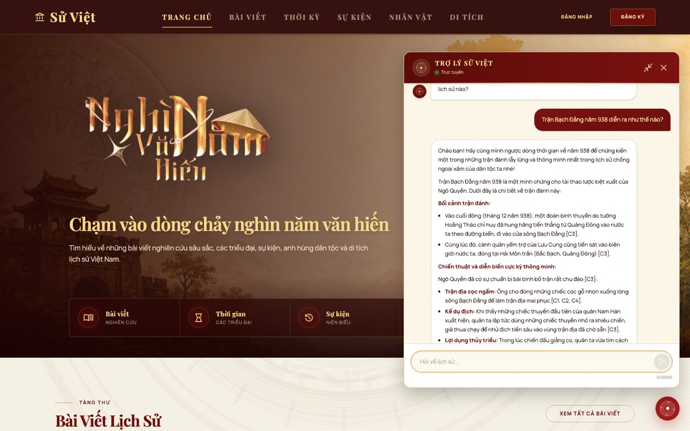
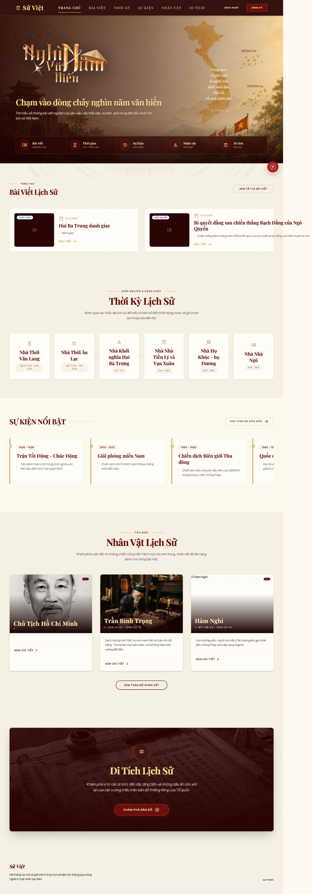
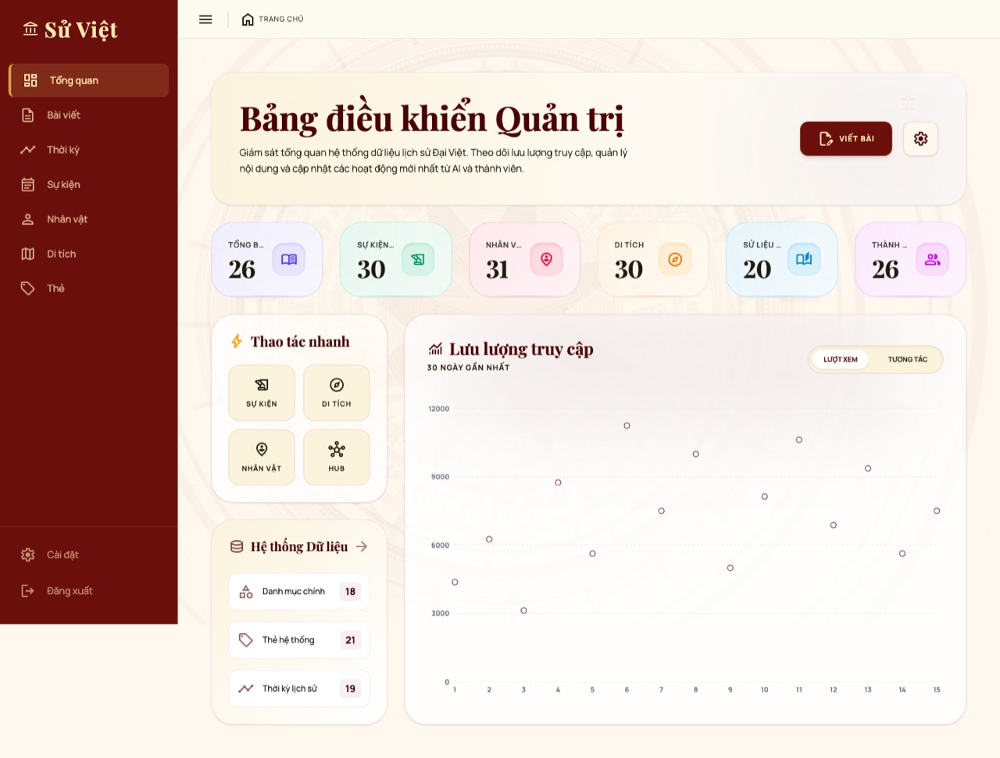
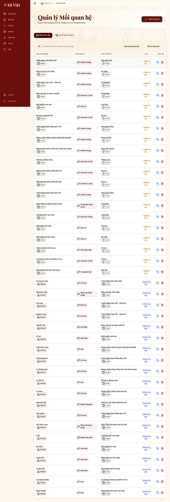

# Sử Việt — History RAG

Website lịch sử Việt Nam tích hợp CMS quản trị nội dung và trợ lý AI (RAG + GraphRAG) trả lời câu hỏi lịch sử có trích dẫn nguồn.

## Kiến trúc hệ thống

- `frontend/`: ReactJS 19 + Vite + Tailwind. Giao diện người dùng (tra cứu lịch sử, chatbot AI) và giao diện quản trị (CMS). Chỉ gọi Spring Boot Backend.
- `backend/`: Java 25 + Spring Boot 4, gateway chính, chia theo module/domain (post, event, character, location, record, member, admin, auth...). Lưu dữ liệu trên MySQL (TiDB Cloud), migrate bằng Flyway.
- `rag-service/`: Python FastAPI, pipeline RAG thật (Qdrant Cloud cho vector search, Neo4j Aura cho GraphRAG, Gemini/Gemma cho LLM & embedding), có cache FAQ và nhánh wiki-local RRF.
- `docs/`: tài liệu thiết kế kiến trúc, ERD, pipeline RAG, kịch bản demo...

```
frontend (Vite :5173) → backend (Spring Boot :8081) → rag-service (FastAPI :8001/8002)
                              │                              │
                          MySQL/TiDB Cloud          Qdrant Cloud + Neo4j Aura
```

## Chạy local

### Backend

Dự án build bằng Java 25 (`java.version=25` trong `pom.xml`) — cần JDK 25, không chạy được bằng JDK 21 trở xuống (lỗi `UnsupportedClassVersionError`).

```bash
cd backend
export JAVA_HOME=$(/usr/libexec/java_home -v 25)
mvn spring-boot:run
```

Các biến môi trường (`MYSQL_URL`, `JWT_SECRET_KEY`, `RAG_SERVICE_URL`, `CORS_ALLOWED_ORIGINS`...) đọc từ `.env` ở thư mục gốc — export trước khi chạy nếu không dùng Docker Compose.

Health:

```text
GET http://localhost:8081/api/health
```

### Frontend

```bash
cd frontend
npm install
npm run dev
```

Frontend dùng `VITE_API_BASE_URL` trong `.env`, mặc định proxy `/api` và `/uploads` sang backend `:8081` (xem `vite.config.js`).

### RAG service

```bash
cd rag-service
python -m venv venv
pip install -r requirements.txt
uvicorn app.main:app --reload --port 8001
```

Health:

```text
GET http://localhost:8001/rag/health
```

## Docker Compose

```bash
cp .env.example .env
docker compose up --build
```

Compose gồm: frontend, backend, rag-service, mysql, qdrant, neo4j.

## Tài khoản mẫu (dữ liệu seed `V2__sample_data.sql`)

| Vai trò | Email | Mật khẩu |
|---|---|---|
| Admin | `admin01@historyrag.local` … `admin20@historyrag.local` | `Password@123` |
| Member | `member01@historyrag.local` … | `Password@123` |

## Ảnh chụp giao diện

**Trợ lý AI (RAG chat, ở chế độ mở rộng)** — trả lời có trích dẫn nguồn, streaming qua SSE:



**Trang chủ**



**Bảng điều khiển quản trị (CMS)**



**Đồ thị tri thức (GraphRAG Hub)**



## Trạng thái hiện tại

- Auth JWT thật, đăng nhập/đăng ký qua MySQL (TiDB Cloud).
- CRUD CMS đầy đủ cho bài viết, sự kiện, nhân vật, địa danh, sử liệu, thẻ, thời kỳ, thành viên.
- RAG chat dùng pipeline thật: Qdrant Cloud (vector search) + Neo4j Aura (GraphRAG) + Gemini/Gemma (LLM & embedding), có cache FAQ và nhánh wiki-local RRF (cờ `WIKI_LOCAL_ENABLED`).
- Trang Hub hiển thị đồ thị tri thức (knowledge graph) trích xuất từ GraphRAG.

## Phase tiếp theo

- Hoàn thiện trải nghiệm quản lý quan hệ thực thể trong Hub.
- Mở rộng evaluation set cho RAG.
- Tối ưu chi phí/độ trễ pipeline LLM.