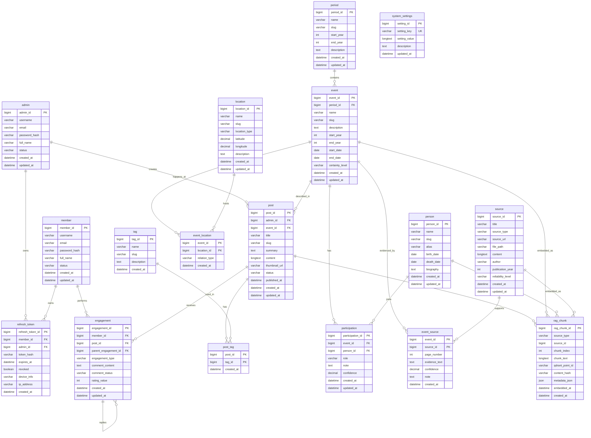

# 22. Logical ERD v2

> Bản ERD này dựng lại từ **conceptual ERD mới** + **bản logical do team vẽ**. Tự chứa, không cần đọc doc cũ (`20`). Mở bằng Markdown Preview (VS Code) để xem sơ đồ.

## 1. Phạm vi & quyết định thiết kế

Website lịch sử Việt Nam: blog CMS + chatbot RAG + Graph RAG. Các quyết định đã chốt:

| Quyết định | Hệ quả lên schema |
|---|---|
| Nội dung lấy từ **PDF chữ thật** + nguồn tham khảo | Bảng `source` giữ text đã trích (`content`) + metadata thư mục; không cần field OCR. |
| **Event/Person nhập tay** (admin curate) | `event`, `person` là bảng đầy đủ, có `description`/`biography` để vừa hiển thị vừa embed. |
| **Tách `admin` / `member`** (không gộp `users`) | Hai bảng riêng; mỗi cái có quan hệ riêng (admin→post, member→engagement). |
| Dùng **JWT + refresh token có thu hồi** | Bảng `refresh_token` (cột `revoked`). Access token JWT không lưu DB; chỉ lưu refresh token để thu hồi / đăng xuất từ xa. |
| **Không lưu lịch sử chat** | Bỏ `chat_sessions`, `chat_messages`. |
| **Cho phép chỉnh tham số RAG** trong admin | Bảng `system_settings` (chunk size, topK, model...). |
| Embedding bằng **Gemini** | Vector **768 chiều** (khai khi tạo collection Qdrant). |
| `rag_chunk` **polymorphic** (`source_type`+`source_id`), **không có hub** | Gọn 1 bảng; đánh đổi: không FK ràng buộc, xóa phải thủ công (xem mục 6). |

**Ranh giới sở hữu dữ liệu:**

| Datastore | Sở hữu bởi | Nội dung | Có trong ERD này? |
|---|---|---|---|
| **MySQL** | Spring Boot | Toàn bộ bảng dưới đây (source of truth) | ✅ Đây chính là ERD |
| **Qdrant Cloud** | FastAPI (RAG) | Vector + payload | ❌ Không |
| **Neo4j Aura** | FastAPI (RAG) | Node + relationship | ❌ Không |

FastAPI **không** đụng MySQL. `rag_chunk` nằm trong MySQL (của Spring Boot), chỉ là **sổ mục lục** phản chiếu nội dung Qdrant.

## 2. Ánh xạ Conceptual → Logical

| Thực thể (conceptual) | Bảng logical | Ghi chú |
|---|---|---|
| Admin | `admin` | Tác giả bài viết. |
| Member | `member` | Người dùng tương tác. |
| Post | `post` | Bài viết (FK `event_id` — xem mục 4). |
| Tag | `tag` + `post_tag` | Many-to-many. |
| Engagement | `engagement` | like/rating + comment lồng (`parent_engagement_id`). |
| Source | `source` + `event_source` | Nguồn tham khảo + cầu "nguồn nào chứng minh sự kiện nào". |
| Event | `event` | Nhập tay; FK `period_id`. |
| Location | `location` + `event_location` | Sự kiện ↔ nhiều địa điểm. |
| Period | `period` | Thời kỳ/triều đại. |
| Person | `person` | Nhập tay. |
| Participation | `participation` | Person ↔ Event, có vai trò. |
| *(JWT)* | `refresh_token` | Refresh token có thu hồi (access token không lưu). |
| *(RAG)* | `rag_chunk` | Polymorphic, cầu MySQL ↔ Qdrant. |
| *(config)* | `system_settings` | Tham số RAG chỉnh runtime. |

## 3. Logical ERD



## 4. Ghi chú cardinality (điểm cần biết)

- **`post.event_id`** → 1 bài viết về **1 sự kiện** (nhiều bài có thể về cùng 1 sự kiện). Nếu sau này 1 bài cần nhắc **nhiều** sự kiện → đổi sang bảng cầu `post_event(post_id, event_id)`.
- **`event.period_id`** → 1 sự kiện thuộc **1 thời kỳ**. Đủ cho hầu hết trường hợp.
- **`event_source` (M:N)** → 1 nguồn chứng minh **nhiều** sự kiện, 1 sự kiện có **nhiều** nguồn. (Đã sửa từ `source.event_id` 1:1 vốn quá chặt.)
- **`event_location` (M:N)** → sự kiện diễn ra ở nhiều địa điểm.
- **`engagement.parent_engagement_id`** → tự trỏ chính nó cho comment lồng (reply).

## 5. Bốn điểm chạm RAG

1. **Vào Qdrant** — `post`, `event`, `person`, `source` mỗi nguồn được cắt thành nhiều `rag_chunk` → đẩy vector lên Qdrant Cloud. Loại nguồn ghi ở `rag_chunk.source_type`.
2. **Citation** — chatbot trả `source_type` + `source_id` (+ `page_number` trong `metadata_json`) → resolve về bản ghi gốc để hiển thị "Nguồn: ...".
3. **`event_source`** — admin gắn bằng chứng cho từng sự kiện ở trang duyệt, kèm `page_number`/`evidence_text`.
4. **Neo4j** — `event/person/location/period/participation` đẩy sang Neo4j Aura (xem mục 7).

## 6. Chi tiết các bảng quan trọng

### `rag_chunk` — cầu MySQL ↔ Qdrant (polymorphic)

| Column | Type | Ghi chú |
|---|---|---|
| `rag_chunk_id` | BIGINT | PK |
| `source_type` | VARCHAR(50) | `POST`, `EVENT`, `PERSON`, `SOURCE` |
| `source_id` | BIGINT | ID của bản ghi nguồn theo `source_type` — **không phải FK ràng buộc** |
| `chunk_index` | INT | Thứ tự đoạn trong nguồn |
| `chunk_text` | LONGTEXT | Text đoạn (bản sao để re-embed/debug) |
| `qdrant_point_id` | VARCHAR(64) | ID điểm trong Qdrant |
| `content_hash` | VARCHAR(64) | SHA-256 → biết khi nào re-embed |
| `metadata_json` | JSON | Payload denorm: `page_number`, `tag_ids`, `period_id`, `embedding_model`... |
| `embedded_at` | DATETIME | Thời điểm embed |

> ⚠️ **Polymorphic — hệ quả phải xử lý ở code:** (a) khi xóa Post/Event/Person/Source phải **chủ động** xóa `rag_chunk` tương ứng + điểm Qdrant (không có CASCADE); (b) `UNIQUE (source_type, source_id, chunk_index)`, INDEX (`source_type`,`source_id`) và `qdrant_point_id`.

### `event_source` — bằng chứng cho sự kiện (M:N)

| Column | Type | Ghi chú |
|---|---|---|
| `event_id` | BIGINT | PK, FK `event.id` |
| `source_id` | BIGINT | PK, FK `source.id` |
| `page_number` | INT | Trang trong nguồn (cho citation) |
| `evidence_text` | TEXT | Đoạn trích chứng minh |
| `confidence` | DECIMAL | Độ tin cậy |

### `refresh_token` — JWT (tùy chọn)

Access token (JWT) **không lưu**. Bảng này chỉ để **thu hồi** refresh token (`revoked`) / đăng xuất từ xa. Có `member_id` **và** `admin_id` (đúng một cái NOT NULL tùy người đăng nhập). Lưu `token_hash` chứ không lưu token thô.

### `system_settings` — tham số RAG

`setting_key` UNIQUE: ví dụ `chunk_size`, `chunk_overlap`, `top_k`, `embedding_model`, `llm_model`. Admin sửa runtime, **không hard-code** trong code.

## 7. Ánh xạ sang Neo4j (ngoài MySQL)

`person` → `Person`, `event` → `Event`, `location` → `Location`, `period` → `Period`/`Dynasty`; `participation` → `(:Person)-[:PARTICIPATED_IN]->(:Event)`, `event_location` → `[:HAPPENED_AT]`, `event` + `period_id` → `[:BELONGS_TO]`.

> Muốn theo dõi đã sync Neo4j chưa: thêm cột `graph_synced_at` (DATETIME) vào `event/person/location/period/participation`. Hiện bản vẽ bỏ qua cho gọn — thêm khi bắt tay làm Graph sync.

## 8. Index gợi ý

| Bảng | Index |
|---|---|
| `admin` / `member` | UNIQUE `username`, UNIQUE `email` |
| `refresh_token` | INDEX `token_hash`, `member_id`, `admin_id`, `expires_at` |
| `post` | UNIQUE `slug`, INDEX `admin_id`, `event_id`, `status`, `published_at`, FULLTEXT(`title`,`summary`,`content`) |
| `tag` | UNIQUE `name`, UNIQUE `slug` |
| `engagement` | INDEX `member_id`, `post_id`, `parent_engagement_id`, `engagement_type` |
| `event` | UNIQUE `slug`, INDEX `period_id`, `start_year`, `certainty_level` |
| `person` | UNIQUE `slug`, INDEX `name` |
| `location` | UNIQUE `slug`, INDEX `location_type` |
| `source` | INDEX `source_type`, `reliability_level` |
| `event_source` | PK (`event_id`,`source_id`) |
| `rag_chunk` | UNIQUE (`source_type`,`source_id`,`chunk_index`), INDEX `qdrant_point_id` |
| `system_settings` | UNIQUE `setting_key` |

## 9. Lưu ý triển khai

- Dùng **Flyway** (`backend/src/main/resources/db/migration/V1__init.sql`) thay cho `JPA_DDL_AUTO=update`.
- `metadata_json` trong `rag_chunk` là nơi ép phẳng payload → lúc query Qdrant không cần JOIN MySQL.
- Vì `rag_chunk` polymorphic: viết 1 service `RagChunkCleanup` lo việc xóa chunk + điểm Qdrant khi nguồn bị xóa/sửa (thay cho ON DELETE CASCADE).

## 10. Ngoài scope — mở rộng tương lai

> ⏸️ **Cây gia phả (quan hệ họ hàng giữa nhân vật) — CHƯA làm trong phạm vi này.**
>
> Hiện `person` không có quan hệ person ↔ person. Khi cần dựng gia phả (trả lời "ai là con của X", "dòng dõi nhà Trần", "X và Y có họ hàng không"), thêm **1 bảng tự trỏ** — thuần cộng thêm, **không sửa bảng nào sẵn có**:
>
> ```
> person_relation (
>   relation_id    PK,
>   from_person_id FK → person,
>   to_person_id   FK → person,
>   relation_type,   -- PARENT_OF, SPOUSE_OF, SIBLING_OF (CHILD_OF = đảo của PARENT_OF)
>   confidence, note, created_at
> )
> ```
>
> Ánh xạ Neo4j: `PARENT_OF` → `(:Person)-[:PARENT_OF]->(:Person)` (có hướng), `SPOUSE_OF` → `(:Person)-[:SPOUSE_OF]-(:Person)` (đối xứng). Đây là "đất diễn" của Graph RAG.
>
> Thêm sau bằng migration `V2__add_person_relation.sql` khi cần — **không đụng `V1`**, không rework.
