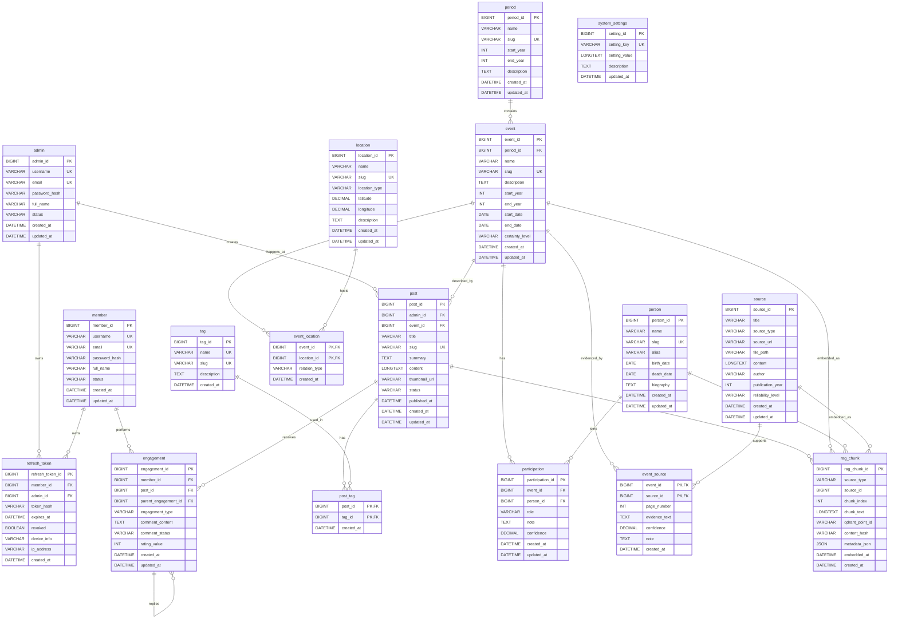

# Physical ERD

> MySQL 8 physical ERD for History RAG.
> Derived from [`22-logical-erd-v2.md`](22-logical-erd-v2.md), [`23-physical-data-model.md`](23-physical-data-model.md), and [`V1__init.sql`](../backend/src/main/resources/db/migration/V1__init.sql).
> Update this file whenever the physical schema changes.

---

## Entity Relationship Diagram



Notes:
- `rag_chunk.source_type + rag_chunk.source_id` is polymorphic and has no physical FK. The ERD lines from `post`, `event`, `person`, and `source` show application-level ownership only.
- `refresh_token` can belong to either `admin` or `member`. The physical CHECK requires at least one owner.

---

## Tables

### admin

| Column | Type | Constraints | Description |
|--------|------|-------------|-------------|
| admin_id | BIGINT | PK, AUTO_INCREMENT | Admin identifier |
| username | VARCHAR(50) | NOT NULL, UNIQUE | Login username |
| email | VARCHAR(255) | NOT NULL, UNIQUE | Login email |
| password_hash | VARCHAR(255) | NOT NULL | BCrypt password hash |
| full_name | VARCHAR(255) | NULLABLE | Display name |
| status | VARCHAR(20) | NOT NULL, DEFAULT 'ACTIVE' | Enum-like: ACTIVE, LOCKED |
| created_at | DATETIME | NOT NULL, DEFAULT CURRENT_TIMESTAMP | Created timestamp |
| updated_at | DATETIME | NOT NULL, DEFAULT CURRENT_TIMESTAMP ON UPDATE CURRENT_TIMESTAMP | Last updated timestamp |

Indexes:
- `UNIQUE KEY uq_admin_username (username)`
- `UNIQUE KEY uq_admin_email (email)`

### member

| Column | Type | Constraints | Description |
|--------|------|-------------|-------------|
| member_id | BIGINT | PK, AUTO_INCREMENT | Member identifier |
| username | VARCHAR(50) | NOT NULL, UNIQUE | Login username |
| email | VARCHAR(255) | NOT NULL, UNIQUE | Login email |
| password_hash | VARCHAR(255) | NOT NULL | BCrypt password hash |
| full_name | VARCHAR(255) | NULLABLE | Display name |
| status | VARCHAR(20) | NOT NULL, DEFAULT 'ACTIVE' | Enum-like status |
| created_at | DATETIME | NOT NULL, DEFAULT CURRENT_TIMESTAMP | Created timestamp |
| updated_at | DATETIME | NOT NULL, DEFAULT CURRENT_TIMESTAMP ON UPDATE CURRENT_TIMESTAMP | Last updated timestamp |

Indexes:
- `UNIQUE KEY uq_member_username (username)`
- `UNIQUE KEY uq_member_email (email)`

### refresh_token

| Column | Type | Constraints | Description |
|--------|------|-------------|-------------|
| refresh_token_id | BIGINT | PK, AUTO_INCREMENT | Refresh token identifier |
| member_id | BIGINT | FK -> member(member_id), NULLABLE, ON DELETE CASCADE | Member owner |
| admin_id | BIGINT | FK -> admin(admin_id), NULLABLE, ON DELETE CASCADE | Admin owner |
| token_hash | VARCHAR(255) | NOT NULL | Hash of refresh token |
| expires_at | DATETIME | NOT NULL | Expiration time |
| revoked | BOOLEAN | NOT NULL, DEFAULT FALSE | Revocation flag |
| device_info | VARCHAR(255) | NULLABLE | Client device metadata |
| ip_address | VARCHAR(45) | NULLABLE | IPv4 or IPv6 address |
| created_at | DATETIME | NOT NULL, DEFAULT CURRENT_TIMESTAMP | Created timestamp |

Indexes:
- `KEY idx_refresh_token_hash (token_hash)`
- `KEY idx_refresh_token_member (member_id)`
- `KEY idx_refresh_token_admin (admin_id)`
- `KEY idx_refresh_token_expires (expires_at)`

Checks:
- `chk_refresh_token_owner`: `member_id IS NOT NULL OR admin_id IS NOT NULL`

### period

| Column | Type | Constraints | Description |
|--------|------|-------------|-------------|
| period_id | BIGINT | PK, AUTO_INCREMENT | Period identifier |
| name | VARCHAR(255) | NOT NULL | Period name |
| slug | VARCHAR(255) | NOT NULL, UNIQUE | URL-safe slug |
| start_year | INT | NULLABLE | Start year |
| end_year | INT | NULLABLE | End year |
| description | TEXT | NULLABLE | Period description |
| created_at | DATETIME | NOT NULL, DEFAULT CURRENT_TIMESTAMP | Created timestamp |
| updated_at | DATETIME | NOT NULL, DEFAULT CURRENT_TIMESTAMP ON UPDATE CURRENT_TIMESTAMP | Last updated timestamp |

Indexes:
- `UNIQUE KEY uq_period_slug (slug)`
- `KEY idx_period_years (start_year, end_year)`

### person

| Column | Type | Constraints | Description |
|--------|------|-------------|-------------|
| person_id | BIGINT | PK, AUTO_INCREMENT | Person identifier |
| name | VARCHAR(255) | NOT NULL | Person name |
| slug | VARCHAR(255) | NOT NULL, UNIQUE | URL-safe slug |
| alias | VARCHAR(255) | NULLABLE | Other names |
| birth_date | DATE | NULLABLE | Birth date when known |
| death_date | DATE | NULLABLE | Death date when known |
| biography | TEXT | NULLABLE | Biography text for display and embedding |
| created_at | DATETIME | NOT NULL, DEFAULT CURRENT_TIMESTAMP | Created timestamp |
| updated_at | DATETIME | NOT NULL, DEFAULT CURRENT_TIMESTAMP ON UPDATE CURRENT_TIMESTAMP | Last updated timestamp |

Indexes:
- `UNIQUE KEY uq_person_slug (slug)`
- `KEY idx_person_name (name)`

### location

| Column | Type | Constraints | Description |
|--------|------|-------------|-------------|
| location_id | BIGINT | PK, AUTO_INCREMENT | Location identifier |
| name | VARCHAR(255) | NOT NULL | Location name |
| slug | VARCHAR(255) | NOT NULL, UNIQUE | URL-safe slug |
| location_type | VARCHAR(50) | NULLABLE | Enum-like: CITY, BATTLEFIELD, TEMPLE |
| latitude | DECIMAL(9,6) | NULLABLE | Latitude |
| longitude | DECIMAL(9,6) | NULLABLE | Longitude |
| description | TEXT | NULLABLE | Location description |
| created_at | DATETIME | NOT NULL, DEFAULT CURRENT_TIMESTAMP | Created timestamp |
| updated_at | DATETIME | NOT NULL, DEFAULT CURRENT_TIMESTAMP ON UPDATE CURRENT_TIMESTAMP | Last updated timestamp |

Indexes:
- `UNIQUE KEY uq_location_slug (slug)`
- `KEY idx_location_type (location_type)`

### event

| Column | Type | Constraints | Description |
|--------|------|-------------|-------------|
| event_id | BIGINT | PK, AUTO_INCREMENT | Event identifier |
| period_id | BIGINT | FK -> period(period_id), NULLABLE, ON DELETE SET NULL | Historical period |
| name | VARCHAR(500) | NOT NULL | Event name |
| slug | VARCHAR(500) | NOT NULL, UNIQUE | URL-safe slug |
| description | TEXT | NULLABLE | Event description for display and embedding |
| start_year | INT | NULLABLE | Start year |
| end_year | INT | NULLABLE | End year |
| start_date | DATE | NULLABLE | Exact start date when known |
| end_date | DATE | NULLABLE | Exact end date when known |
| certainty_level | VARCHAR(20) | NULLABLE | Enum-like: CERTAIN, ESTIMATED, DISPUTED |
| created_at | DATETIME | NOT NULL, DEFAULT CURRENT_TIMESTAMP | Created timestamp |
| updated_at | DATETIME | NOT NULL, DEFAULT CURRENT_TIMESTAMP ON UPDATE CURRENT_TIMESTAMP | Last updated timestamp |

Indexes:
- `UNIQUE KEY uq_event_slug (slug)`
- `KEY idx_event_period (period_id)`
- `KEY idx_event_start_year (start_year)`
- `KEY idx_event_certainty (certainty_level)`

### post

| Column | Type | Constraints | Description |
|--------|------|-------------|-------------|
| post_id | BIGINT | PK, AUTO_INCREMENT | Post identifier |
| admin_id | BIGINT | FK -> admin(admin_id), NOT NULL, ON DELETE RESTRICT | Author |
| event_id | BIGINT | FK -> event(event_id), NULLABLE, ON DELETE SET NULL | Main event described by the post |
| title | VARCHAR(500) | NOT NULL | Post title |
| slug | VARCHAR(500) | NOT NULL, UNIQUE | URL-safe slug |
| summary | TEXT | NULLABLE | Short summary |
| content | LONGTEXT | NULLABLE | Full content for display and embedding |
| thumbnail_url | VARCHAR(1000) | NULLABLE | Thumbnail path or URL |
| status | VARCHAR(20) | NOT NULL, DEFAULT 'DRAFT' | Enum-like: DRAFT, PUBLISHED, ARCHIVED |
| published_at | DATETIME | NULLABLE | Publish timestamp |
| created_at | DATETIME | NOT NULL, DEFAULT CURRENT_TIMESTAMP | Created timestamp |
| updated_at | DATETIME | NOT NULL, DEFAULT CURRENT_TIMESTAMP ON UPDATE CURRENT_TIMESTAMP | Last updated timestamp |

Indexes:
- `UNIQUE KEY uq_post_slug (slug)`
- `KEY idx_post_admin (admin_id)`
- `KEY idx_post_event (event_id)`
- `KEY idx_post_status (status)`
- `KEY idx_post_published (published_at)`
- `FULLTEXT KEY ftx_post (title, summary, content)`

### tag

| Column | Type | Constraints | Description |
|--------|------|-------------|-------------|
| tag_id | BIGINT | PK, AUTO_INCREMENT | Tag identifier |
| name | VARCHAR(100) | NOT NULL, UNIQUE | Tag name |
| slug | VARCHAR(100) | NOT NULL, UNIQUE | URL-safe slug |
| description | TEXT | NULLABLE | Tag description |
| created_at | DATETIME | NOT NULL, DEFAULT CURRENT_TIMESTAMP | Created timestamp |

Indexes:
- `UNIQUE KEY uq_tag_name (name)`
- `UNIQUE KEY uq_tag_slug (slug)`

### post_tag (Join Table)

| Column | Type | Constraints | Description |
|--------|------|-------------|-------------|
| post_id | BIGINT | PK, FK -> post(post_id), NOT NULL, ON DELETE CASCADE | Post |
| tag_id | BIGINT | PK, FK -> tag(tag_id), NOT NULL, ON DELETE CASCADE | Tag |
| created_at | DATETIME | NOT NULL, DEFAULT CURRENT_TIMESTAMP | Created timestamp |

- Composite PK: `(post_id, tag_id)`

Indexes:
- `KEY idx_post_tag_tag (tag_id)`

### engagement

| Column | Type | Constraints | Description |
|--------|------|-------------|-------------|
| engagement_id | BIGINT | PK, AUTO_INCREMENT | Engagement identifier |
| member_id | BIGINT | FK -> member(member_id), NOT NULL, ON DELETE CASCADE | Member actor |
| post_id | BIGINT | FK -> post(post_id), NOT NULL, ON DELETE CASCADE | Target post |
| parent_engagement_id | BIGINT | FK -> engagement(engagement_id), NULLABLE, ON DELETE CASCADE | Parent comment for replies |
| engagement_type | VARCHAR(20) | NOT NULL | Enum-like: LIKE, BOOKMARK, VIEW, RATING, COMMENT |
| comment_content | TEXT | NULLABLE | Comment body |
| comment_status | VARCHAR(20) | NULLABLE | Enum-like: VISIBLE, HIDDEN, PENDING |
| rating_value | INT | NULLABLE | Rating value |
| created_at | DATETIME | NOT NULL, DEFAULT CURRENT_TIMESTAMP | Created timestamp |
| updated_at | DATETIME | NOT NULL, DEFAULT CURRENT_TIMESTAMP ON UPDATE CURRENT_TIMESTAMP | Last updated timestamp |

Indexes:
- `KEY idx_engagement_member (member_id)`
- `KEY idx_engagement_post (post_id)`
- `KEY idx_engagement_parent (parent_engagement_id)`
- `KEY idx_engagement_type (engagement_type)`

### event_location (Join Table)

| Column | Type | Constraints | Description |
|--------|------|-------------|-------------|
| event_id | BIGINT | PK, FK -> event(event_id), NOT NULL, ON DELETE CASCADE | Event |
| location_id | BIGINT | PK, FK -> location(location_id), NOT NULL, ON DELETE CASCADE | Location |
| relation_type | VARCHAR(50) | NULLABLE | Enum-like: HAPPENED_AT, CAPITAL, BIRTH_PLACE |
| created_at | DATETIME | NOT NULL, DEFAULT CURRENT_TIMESTAMP | Created timestamp |

- Composite PK: `(event_id, location_id)`

Indexes:
- `KEY idx_event_location_location (location_id)`

### participation

| Column | Type | Constraints | Description |
|--------|------|-------------|-------------|
| participation_id | BIGINT | PK, AUTO_INCREMENT | Participation identifier |
| event_id | BIGINT | FK -> event(event_id), NOT NULL, ON DELETE CASCADE | Event |
| person_id | BIGINT | FK -> person(person_id), NOT NULL, ON DELETE CASCADE | Person |
| role | VARCHAR(100) | NULLABLE | Role in event, e.g. KING, GENERAL, WITNESS |
| note | TEXT | NULLABLE | Additional note |
| confidence | DECIMAL(3,2) | NULLABLE | Confidence score from 0.00 to 1.00 |
| created_at | DATETIME | NOT NULL, DEFAULT CURRENT_TIMESTAMP | Created timestamp |
| updated_at | DATETIME | NOT NULL, DEFAULT CURRENT_TIMESTAMP ON UPDATE CURRENT_TIMESTAMP | Last updated timestamp |

Indexes:
- `UNIQUE KEY uq_participation (event_id, person_id, role)`
- `KEY idx_participation_person (person_id)`

### source

| Column | Type | Constraints | Description |
|--------|------|-------------|-------------|
| source_id | BIGINT | PK, AUTO_INCREMENT | Source identifier |
| title | VARCHAR(500) | NOT NULL | Source title |
| source_type | VARCHAR(50) | NOT NULL | Enum-like: BOOK, ARTICLE, PDF, URL, MANUAL |
| source_url | VARCHAR(1000) | NULLABLE | External source URL |
| file_path | VARCHAR(1000) | NULLABLE | Original file path |
| content | LONGTEXT | NULLABLE | Extracted text for embedding |
| author | VARCHAR(255) | NULLABLE | Author |
| publication_year | INT | NULLABLE | Publication year |
| reliability_level | VARCHAR(20) | NULLABLE | Enum-like: HIGH, MEDIUM, LOW |
| created_at | DATETIME | NOT NULL, DEFAULT CURRENT_TIMESTAMP | Created timestamp |
| updated_at | DATETIME | NOT NULL, DEFAULT CURRENT_TIMESTAMP ON UPDATE CURRENT_TIMESTAMP | Last updated timestamp |

Indexes:
- `KEY idx_source_type (source_type)`
- `KEY idx_source_reliability (reliability_level)`

### event_source (Join Table)

| Column | Type | Constraints | Description |
|--------|------|-------------|-------------|
| event_id | BIGINT | PK, FK -> event(event_id), NOT NULL, ON DELETE CASCADE | Event |
| source_id | BIGINT | PK, FK -> source(source_id), NOT NULL, ON DELETE CASCADE | Evidence source |
| page_number | INT | NULLABLE | Citation page |
| evidence_text | TEXT | NULLABLE | Evidence excerpt |
| confidence | DECIMAL(3,2) | NULLABLE | Confidence score from 0.00 to 1.00 |
| note | TEXT | NULLABLE | Additional note |
| created_at | DATETIME | NOT NULL, DEFAULT CURRENT_TIMESTAMP | Created timestamp |

- Composite PK: `(event_id, source_id)`

Indexes:
- `KEY idx_event_source_source (source_id)`

### rag_chunk

| Column | Type | Constraints | Description |
|--------|------|-------------|-------------|
| rag_chunk_id | BIGINT | PK, AUTO_INCREMENT | Chunk identifier |
| source_type | VARCHAR(50) | NOT NULL | Enum-like: POST, EVENT, PERSON, SOURCE |
| source_id | BIGINT | NOT NULL, no FK | ID of the source row according to source_type |
| chunk_index | INT | NOT NULL | Chunk order inside the source |
| chunk_text | LONGTEXT | NULLABLE | Text copied for re-embedding/debug |
| qdrant_point_id | VARCHAR(64) | NULLABLE | Qdrant point ID |
| content_hash | VARCHAR(64) | NULLABLE | SHA-256 hash used to detect content changes |
| metadata_json | JSON | NULLABLE | Denormalized payload for citation/retrieval |
| embedded_at | DATETIME | NULLABLE | Embedding timestamp |
| created_at | DATETIME | NOT NULL, DEFAULT CURRENT_TIMESTAMP | Created timestamp |

Indexes:
- `UNIQUE KEY uq_rag_chunk (source_type, source_id, chunk_index)`
- `KEY idx_rag_chunk_source (source_type, source_id)`
- `KEY idx_rag_chunk_point (qdrant_point_id)`

Notes:
- No FK is declared on `source_id` because the table is polymorphic.
- Application services must delete related chunks and Qdrant points when a Post/Event/Person/Source is deleted or re-embedded.

### system_settings

| Column | Type | Constraints | Description |
|--------|------|-------------|-------------|
| setting_id | BIGINT | PK, AUTO_INCREMENT | Setting identifier |
| setting_key | VARCHAR(100) | NOT NULL, UNIQUE | Runtime setting key |
| setting_value | LONGTEXT | NULLABLE | Runtime setting value |
| description | TEXT | NULLABLE | Human-readable description |
| updated_at | DATETIME | NOT NULL, DEFAULT CURRENT_TIMESTAMP ON UPDATE CURRENT_TIMESTAMP | Last updated timestamp |

Indexes:
- `UNIQUE KEY uq_system_settings_key (setting_key)`

---

## Relationships Summary

| Relationship | Type | Physical FK / Constraint | Delete Behavior |
|-------------|------|--------------------------|-----------------|
| Admin -> Post | OneToMany | `post.admin_id -> admin.admin_id` | RESTRICT |
| Admin -> RefreshToken | OneToMany | `refresh_token.admin_id -> admin.admin_id` | CASCADE |
| Member -> RefreshToken | OneToMany | `refresh_token.member_id -> member.member_id` | CASCADE |
| Member -> Engagement | OneToMany | `engagement.member_id -> member.member_id` | CASCADE |
| Period -> Event | OneToMany | `event.period_id -> period.period_id` | SET NULL |
| Event -> Post | OneToMany | `post.event_id -> event.event_id` | SET NULL |
| Post -> Tag | ManyToMany | `post_tag(post_id, tag_id)` | CASCADE |
| Post -> Engagement | OneToMany | `engagement.post_id -> post.post_id` | CASCADE |
| Engagement -> Engagement | OneToMany self-reference | `engagement.parent_engagement_id -> engagement.engagement_id` | CASCADE |
| Event -> Location | ManyToMany | `event_location(event_id, location_id)` | CASCADE |
| Event -> Person | ManyToMany with attributes | `participation(event_id, person_id, role)` | CASCADE |
| Event -> Source | ManyToMany with attributes | `event_source(event_id, source_id)` | CASCADE |
| Post/Event/Person/Source -> RagChunk | OneToMany, application-level | `rag_chunk(source_type, source_id)` | Manual cleanup in app |

---

## Physical Design Notes

### MySQL conventions

- DBMS: MySQL 8.
- Engine: InnoDB for FK and transaction support.
- Charset: `utf8mb4` for Vietnamese text.
- Primary keys: `BIGINT AUTO_INCREMENT`.
- Timestamps: `DATETIME DEFAULT CURRENT_TIMESTAMP`; mutable tables use `updated_at ... ON UPDATE CURRENT_TIMESTAMP`.
- Boolean: MySQL `BOOLEAN`, physically stored as `TINYINT(1)`.
- JSON: native MySQL `JSON` for `rag_chunk.metadata_json`.
- Coordinates: `DECIMAL(9,6)` for latitude/longitude.
- Confidence scores: `DECIMAL(3,2)` for values from `0.00` to `1.00`.

### RAG boundaries

- MySQL is the source of truth for `post`, `event`, `person`, `source`, and `rag_chunk`.
- Qdrant stores vectors and payload; `rag_chunk.qdrant_point_id` points to Qdrant.
- Neo4j stores graph projection for `person`, `event`, `location`, `period`, and relationship data.
- FastAPI should not mutate MySQL directly. Spring Boot owns MySQL writes.

### Token storage

- Access JWT is not stored in MySQL.
- `refresh_token.token_hash` stores the refresh token hash, not the raw token.
- `revoked` supports logout, remote logout, and token rotation.

---

## JPA Entity Mapping Reference

### Post

```java
@ManyToOne(fetch = FetchType.LAZY)
@JoinColumn(name = "admin_id", nullable = false)
private Admin admin;

@ManyToOne(fetch = FetchType.LAZY)
@JoinColumn(name = "event_id")
private Event event;

@ManyToMany(fetch = FetchType.LAZY)
@JoinTable(
        name = "post_tag",
        joinColumns = @JoinColumn(name = "post_id"),
        inverseJoinColumns = @JoinColumn(name = "tag_id")
)
private List<Tag> tags;
```

### Engagement

```java
@ManyToOne(fetch = FetchType.LAZY)
@JoinColumn(name = "member_id", nullable = false)
private Member member;

@ManyToOne(fetch = FetchType.LAZY)
@JoinColumn(name = "post_id", nullable = false)
private Post post;

@ManyToOne(fetch = FetchType.LAZY)
@JoinColumn(name = "parent_engagement_id")
private Engagement parentEngagement;
```

### Historical Graph Tables

```java
@ManyToOne(fetch = FetchType.LAZY)
@JoinColumn(name = "period_id")
private Period period;

@ManyToMany(fetch = FetchType.LAZY)
@JoinTable(
        name = "event_location",
        joinColumns = @JoinColumn(name = "event_id"),
        inverseJoinColumns = @JoinColumn(name = "location_id")
)
private List<Location> locations;

@OneToMany(mappedBy = "event", fetch = FetchType.LAZY)
private List<Participation> participations;
```

### RagChunk

```java
@Column(name = "source_type", nullable = false, length = 50)
private String sourceType;

@Column(name = "source_id", nullable = false)
private Long sourceId;

@Column(name = "metadata_json", columnDefinition = "JSON")
private String metadataJson;
```

Notes:
- Do not model `rag_chunk.source_id` as a JPA relation because it is polymorphic.
- Use `FetchType.LAZY` for all `@ManyToOne`, `@OneToMany`, and `@ManyToMany` relationships.
- Use DTOs for API responses; do not expose entities directly.

---

## Seed Data

### system_settings

| setting_key | setting_value | Description |
|-------------|---------------|-------------|
| rag.chunk_size | 800 | Số ký tự mỗi chunk |
| rag.chunk_overlap | 120 | Overlap giữa các chunk |
| rag.top_k | 5 | Số chunk retrieve mỗi câu hỏi |
| rag.embedding_model | text-embedding-004 | Gemini embedding model |
| rag.vector_size | 768 | Qdrant vector size for Gemini embeddings |
| rag.llm_model | gemini-2.0-flash | Gemini LLM model |
| rag.temperature | 0.2 | LLM temperature |
| rag.enable_graph | true | Enable Graph RAG via Neo4j |

Notes:
- First admin account should be created through an API or a dedicated seed migration.
- `password_hash` must always contain a real password hash, for example BCrypt.

---

## Migration Notes

- Total tables: 17.
- Main migration file: [`V1__init.sql`](../backend/src/main/resources/db/migration/V1__init.sql).
- The migration uses `SET NAMES utf8mb4` and creates every table with `ENGINE=InnoDB DEFAULT CHARSET=utf8mb4`.
- Flyway should become the schema source of truth once backend integration starts.
- Recommended JPA setting when Flyway is enabled: `ddl-auto=validate` or `ddl-auto=none`.
- Do not edit `V1__init.sql` after it has run in a shared environment. Add a new migration, for example `V2__add_person_relation.sql`.
- `rag_chunk` cleanup cannot rely on database cascade. Implement cleanup in Spring Boot services when source content is deleted or re-embedded.
