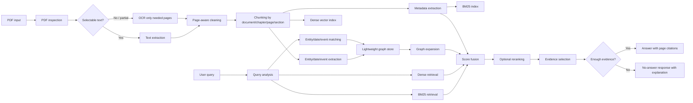

# Final Academic Quality Audit and Architecture Proposal

Topic 1: A Systematic Literature Review of Embedding Models for Vietnamese Text Retrieval with a Focus on Vietnamese Historical Documents.

Topic 2: A Literature-Informed Retrieval Architecture for Vietnamese Historical Documents.

Core conclusion preserved: no direct benchmark evidence was found for Vietnamese historical document retrieval. Model recommendations must be framed as candidate suitability, not as a proven best-model ranking.

## Part A. Final Academic Quality Audit

### 1. Reference Integrity Audit

| Citation key | Status | Issue found | Required fix | Severity |
| --- | --- | --- | --- | --- |
| nguyen-quan-2026-works | OK | ACL page verifies title, authors, year, DOI, pages, and official URL. | None. | OK |
| pham-etal-2026-vn | OK | ACL page verifies title, authors, year, DOI, pages, and official URL. | None. | OK |
| nguyen-etal-2024-advancing | OK | Official ACL/PACLIC page verified; no DOI visible. | Keep ACL URL; no DOI needed. | OK |
| khang-etal-2024-vietnamese-legal | OK | Official ScienceDirect page and DOI verified. | None. | OK |
| nguyen-etal-2025-improving | OK | ACL page verifies title, authors, year, DOI, and official URL. | None. | OK |
| ba-etal-2024-vietnamese-legal-ir | OK | arXiv page verified; arXiv report, not peer-reviewed. | Keep as arXiv/supporting or domain evidence, not strongest peer-reviewed evidence. | Minor |
| zhang-etal-2023-miracl | Fixed | Original BibTeX used TACL site without DOI and had a less precise author name form. | Updated to ACL/TACL URL, DOI, pages, and `Alfonso-Hermelo`. | Major fixed |
| bonifacio-etal-2021-mmarco | Fixed | Text previously implied Vietnamese support directly from mMARCO paper. The paper is multilingual background; Vietnamese use should be verified through dataset releases or VN-MTEB. | Softened wording in `main.tex` and `slr-deliverables.md`. | Minor fixed |
| chen-etal-2024-m3 | OK | ACL page verifies BGE-M3 paper metadata and DOI. | None. | OK |
| wang-etal-2024-me5 | OK | arXiv page verifies title, authors, year, DOI, and URL. | Keep as technical report/arXiv evidence. | OK |
| feng-etal-2022-language | OK | ACL page verifies LaBSE metadata and DOI. | None. | OK |
| nguyen-tuan-nguyen-2020-phobert | OK | ACL page verifies PhoBERT metadata and DOI. | None. | OK |
| reimers-gurevych-2019-sentence | OK | ACL page verifies SBERT metadata and DOI. | None. | OK |
| muennighoff-etal-2023-mteb | Fixed | Original BibTeX used only arXiv. Official ACL EACL entry exists. | Updated to ACL Anthology URL and DOI `10.18653/v1/2023.eacl-main.148`. | Major fixed |
| thakur-etal-2021-beir | OK | Official OpenReview page verified; no DOI used. | None. | OK |
| zhang-etal-2024-ocr-hinders-rag | OK | arXiv page verifies title, authors, year, DOI, and ICCV 2025 note. | Keep as OCR/RAG evidence, not Vietnamese-specific evidence. | OK |
| nguyen-thiet-2025-sinovietnamese-ocr | OK | arXiv page verifies title, authors, year, DOI, and historical Han-Nom relevance. | Keep as OCR evidence only, not retrieval evidence. | OK |
| alibaba-nlp-2026-gte-multilingual-base | OK | Hugging Face page is official model card, but not peer-reviewed. | Use only as supporting source for model specifications. | Minor |

Citation integrity check after fixes: 18 cited keys, 18 BibTeX entries, no missing keys, no unused entries.

### 2. Claim-to-Citation Audit

| Claim | Current citation | Supported? | Suggested wording | Severity |
| --- | --- | --- | --- | --- |
| VN-MTEB contains 41 Vietnamese embedding datasets. | `pham-etal-2026-vn` | Supported by ACL abstract/page and paper. | Current wording is acceptable. | OK |
| Vietnamese multi-domain IR benchmark covers six domains and ten datasets. | `nguyen-quan-2026-works` | Supported by paper metadata/abstract and source description. | Current wording is acceptable; verify exact count against PDF tables before submission. | Minor |
| BGE-M3 supports dense, sparse, and multi-vector retrieval, 100+ languages, and 8192 tokens. | `chen-etal-2024-m3` | Supported by BGE-M3 paper/model description. | Fixed wording to avoid implying direct historical validation. | OK |
| multilingual E5 uses contrastive pre-training and supervised retrieval-related data. | `wang-etal-2024-me5` | Supported by technical report. | Current wording is acceptable. | OK |
| GTE multilingual has 305M parameters, 768 dimensions, 8192-token context, dense/sparse support, and 70+ languages. | `alibaba-nlp-2026-gte-multilingual-base` | Supported by official model card, not peer-reviewed paper. | Keep as model-card evidence only. | Minor |
| PhoBERT outperformed XLM-R on several Vietnamese NLP tasks, but not retrieval tasks. | `nguyen-tuan-nguyen-2020-phobert` | Supported; correctly caveated. | Current wording is acceptable. | OK |
| BM25 is robust and dense retrieval does not always dominate out of distribution. | `thakur-etal-2021-beir` | Supported by BEIR-style benchmark conclusions; wording is suitably cautious. | Current wording is acceptable. | OK |
| OCR noise can degrade RAG retrieval/generation. | `zhang-etal-2024-ocr-hinders-rag` | Supported by OHRBench arXiv abstract/paper. | Current wording is acceptable. | OK |
| No direct benchmark evidence was found for Vietnamese historical document retrieval. | Search process and evidence log | Supported by this review's search process, not by one paper. | Keep as "was found in this review" if challenged. | OK |
| PRISMA counts are 73 identified, 18 duplicates, 55 screened, 31 excluded, 24 assessed, 18 included. | Methodology table | Internally consistent. | Keep "approximate based on available search results." | OK |
| BGE-M3 and multilingual E5 are first candidates for history retrieval. | `chen-etal-2024-m3`, `wang-etal-2024-me5`, `pham-etal-2026-vn` | Indirectly supported, not direct history evidence. | Current conclusion says "first candidates, not proven best models." | OK |

### 3. Overclaiming Audit

| Original sentence | Risk | Safer replacement |
| --- | --- | --- |
| "The strongest direct evidence comes from recent Vietnamese retrieval..." | "Strongest" can sound like a value judgment. | Fixed to "The most direct evidence comes from..." |
| "Its model documentation also describes hybrid ranking as a supported usage pattern." | Documentation was not separately cited in BibTeX. | Fixed to "These properties make hybrid-style use plausible, although Vietnamese historical retrieval still requires separate validation." |
| "mMARCO provides translated MS MARCO passage ranking data, including Vietnamese..." | Vietnamese inclusion is better supported by downstream datasets/model cards than by the original paper alone. | Fixed to "mMARCO provides a translated MS MARCO passage ranking resource... Vietnamese-specific use should be verified..." |
| "GTE multilingual... Strong baseline requiring validation." | Model-card source is weaker than peer-reviewed evidence. | Fixed to "Candidate baseline requiring validation." |
| "LaBSE evaluated in VN-MTEB but weaker retrieval task scores than newer models." | Comparative claim requires exact table verification. | Fixed to "Included in VN-MTEB and useful as an older cross-lingual baseline." |
| "BGE-M3 hybrid retrieval and multilingual E5 are strong first candidates." | Acceptable if clearly "not proven best"; still should not sound like benchmark ranking. | Keep because sentence explicitly says "not proven best models." |

### 4. PRISMA Audit

| PRISMA component | Status | Issue | Fix |
| --- | --- | --- | --- |
| Records identified | OK | Count is approximate. | Text explicitly says approximate. |
| Duplicates removed | OK | 73 - 18 = 55, consistent. | None. |
| Records screened | OK | 55 screened, 31 excluded, 24 assessed, consistent. | None. |
| Full-text assessed | OK | 24 assessed, 6 excluded, 18 included, consistent. | None. |
| Included sources | OK | 18 BibTeX entries and 18 cited keys. | None. |
| Search strings | OK | Match final included paper areas: Vietnamese retrieval, multilingual embeddings, OCR, legal retrieval. | None. |
| Exclusion reasons | OK | Clear, but broad. | Optional: add a sentence saying "no history benchmark was found after gap-driven searches." Already present. |

### 5. Literature Matrix Audit

| Paper/source | Matrix issue | Suggested fix |
| --- | --- | --- |
| VN-MTEB | None major. | Recheck exact score tables before quoting any numeric result. |
| Which Works Best for Vietnamese? | None major. | Recheck exact domain/dataset counts in PDF before final submission. |
| Advancing Vietnamese IR | None major. | Keep as direct Vietnamese retrieval benchmark; verify exact benchmark composition manually. |
| Vietnamese Legal Text Retrieval | None major. | Use as legal-domain evidence, not history-domain proof. |
| Vietnamese-English CLIR | Uses phrase "state-of-the-art models" in matrix. | Prefer "current retrievers" if polishing. |
| mMARCO | Vietnamese-specific claim was too strong. | Fixed in main text; matrix already says confirm Vietnamese language in implementation. |
| MIRACL | Metadata needed DOI and ACL URL. | Fixed. |
| MTEB | Official ACL entry should be used instead of arXiv-only. | Fixed. |
| GTE model card | Correctly marked as supporting source. | Keep evidence level weak to moderate. |
| OCR sources | Correctly separated from retrieval benchmark evidence. | Keep as OCR risk evidence only. |

### 6. Model Recommendation Audit

| Model | Current claim | Evidence level | Risk | Safer recommendation |
| --- | --- | --- | --- | --- |
| Hybrid BM25 + BGE-M3 | First candidate. | Moderate indirect. | Could sound like best model if table title is misread. | "Recommended as first candidate for pilot validation." |
| multilingual E5 | Strong baseline. | Moderate indirect. | No direct history benchmark. | "Recommended as strong baseline candidate." |
| gte-multilingual-base | Candidate baseline after fix. | Weak to moderate. | Model specs are model-card-supported. | "Supporting candidate; validate before claiming suitability." |
| Vietnamese SBERT/PhoBERT variants | Recommended with fine-tuning. | Weak to moderate. | Original PhoBERT is not retrieval-trained. | "Use if fine-tuned or validated on Vietnamese retrieval pairs." |
| LaBSE | Supporting baseline. | Weak for modern passage retrieval. | Older cross-lingual model. | "Use mainly as cross-lingual baseline." |
| BM25 | Required baseline. | Strong as lexical baseline. | Not an embedding model, but central to retrieval comparison. | "Required lexical baseline for names, dates, and exact terms." |

### 7. OCR/PDF Processing Audit

| OCR topic | Status | Suggested improvement |
| --- | --- | --- |
| OCR is not always needed | OK | Current text clearly says selectable text PDFs do not need OCR. |
| Text/scanned/mixed PDFs | OK | Decision table distinguishes these cases. |
| Old fonts, tables, footnotes | OK | Covered in decision table. |
| OCR effects on embeddings and BM25 | OK | Current text says OCR corrupts tokens, names, dates, headings, and table order. |
| Page metadata | OK | Current text says page numbers should be first-class metadata. |
| Universal OCR improvement claim | OK | No universal OCR-improves-retrieval claim is made. |

### 8. LaTeX Compile Audit

| LaTeX issue | Location | Fix | Severity |
| --- | --- | --- | --- |
| XeLaTeX required because `fontspec` is used. | `main.tex` preamble | Compile on Overleaf with XeLaTeX, not pdfLaTeX. | OK |
| TikZ uses `below=of`. | PRISMA diagram | `\usetikzlibrary{positioning}` is loaded. | OK |
| Duplicate packages | Preamble | No duplicate package issue found. | OK |
| Cite keys | Whole file | Mechanical check passed: no missing or unused BibTeX entries. | OK |
| Long tables | Core studies table | `longtable` is used. | OK |
| Very wide tables | Several tables | Current use of `tabularx` is acceptable; visually inspect on Overleaf. | Minor |
| Local compile | Environment | `xelatex` is not installed locally, so compile must be verified on Overleaf. | Major for final submission |
| Invalid characters | Whole file | No obvious unescaped special characters found. | OK |

Corrected files:

- `paper/main.tex`
- `paper/references.bib`
- `paper/slr-deliverables.md`

## Part B. Defense Preparation

1. Why did you not run a benchmark?
   The study is a systematic literature review. Its purpose is to synthesize existing evidence, not to produce new experimental results. A benchmark would be a separate empirical study.

2. Why do you still recommend BGE-M3 if there is no history benchmark?
   BGE-M3 is recommended only as a candidate because existing Vietnamese and multilingual retrieval evidence suggests it is worth testing. I do not claim it is the best for historical documents.

3. Why include BM25 in an embedding model review?
   BM25 is a necessary retrieval baseline. Historical questions often contain names, years, and exact terms where lexical matching can be important.

4. Why is legal retrieval evidence relevant to history retrieval?
   Legal and historical documents both involve long-form formal text, references, entities, dates, and citation-grounded answers. The evidence is still indirect and should not be treated as proof for history retrieval.

5. What makes Vietnamese historical retrieval difficult?
   It combines Vietnamese diacritics, OCR errors, old fonts, long chapters, named entities, dates, aliases, causal relations, timelines, and page citation requirements.

6. Why not claim Vietnamese-specific models are better?
   The reviewed literature does not show a direct, comparable history benchmark where Vietnamese-specific models consistently beat multilingual models.

7. Why are model-card sources weaker than papers?
   Model cards are useful for specifications and intended use, but they may not be peer-reviewed and may not report controlled comparative evaluation.

8. How reliable are PRISMA counts?
   They are approximate because search result interfaces change. The paper clearly marks them as approximate and asks for manual verification before submission.

9. What is the biggest limitation of this review?
   The main limitation is the lack of direct Vietnamese historical document retrieval benchmarks.

10. What would be the next experiment if time allowed?
    A pilot evaluation with 30-50 manually written historical questions and page-level relevance labels comparing BM25, dense retrieval, hybrid retrieval, and the proposed architecture.

11. Why use hybrid retrieval?
    Hybrid retrieval combines lexical matching for names/dates with dense semantic matching for paraphrases and broader concepts.

12. When is OCR necessary?
    OCR is necessary when the PDF is scanned image-only, partially scanned, or when selectable text extraction loses Vietnamese accents or produces corrupted text.

13. How does OCR noise affect embeddings?
    OCR noise changes tokens, names, dates, and sentence boundaries. That can reduce dense similarity and also hurt BM25 exact matching.

14. Why preserve page numbers?
    Page numbers allow citation-grounded answers and help users verify evidence in the original document.

15. What is the main contribution of this paper?
    The paper gives a conservative evidence synthesis and identifies candidate models plus OCR-aware retrieval requirements for Vietnamese historical documents.

## Part C. Architecture Proposal

### 1. Executive Summary

The most practical candidate architecture is **Page-Aware Hybrid Temporal Entity RAG**. It is lighter than full GraphRAG but richer than standard dense RAG. It combines page-aware PDF processing, OCR only when needed, BM25, dense retrieval, metadata filters, entity/date/event extraction, a lightweight graph, score fusion, optional reranking, and answer generation with citations.

GraphRAG is not automatically necessary. Full GraphRAG with community detection and global summaries is useful for corpus-level synthesis questions, but it is costly and complex for an undergraduate prototype. A graph-lite approach is more practical: extract people, organizations, locations, events, dates, periods, policies, and concepts; connect them to pages/chunks; use the graph for expansion and explanation.

Recommended architecture:

- Base layer: metadata-aware hybrid retrieval.
- Historical layer: temporal/entity/event extraction and lightweight graph expansion.
- Evidence layer: page-aware chunking and citation selection.
- Optional layer: reranker and LLM answer generation with no-answer fallback.

Avoid:

- Embedding-only retrieval as the only retriever.
- Full GraphRAG as the first prototype.
- OCR on clean text PDFs.
- Claims that one architecture is empirically superior without a pilot evaluation.
- Answers without page/chapter citations.

### 2. Literature Search Summary

Sources searched: arXiv, ACL Anthology, OpenReview, ACM DOI pages where available, official GitHub repositories, Hugging Face model cards, ScienceDirect, and existing verified Vietnamese retrieval sources.

Search strings used included: "GraphRAG retrieval augmented generation knowledge graph", "LightRAG retrieval augmented generation graph", "hybrid retrieval RAG BM25 dense retrieval", "hierarchical retrieval augmented generation", "RAPTOR tree-organized retrieval", "metadata aware retrieval augmented generation", "temporal information retrieval", "entity-centric retrieval augmented generation", "multi-hop retrieval augmented generation", "query decomposition retrieval augmented generation", "agentic RAG", "OCR-aware retrieval augmented generation", "Vietnamese historical document retrieval", "Vietnamese OCR historical documents retrieval", and "Vietnamese multi-domain information retrieval".

Approximate flow: 52 records found; 34 screened by title/abstract/official page; 21 opened from official pages; 18 used as verified academic or official sources. Counts are approximate.

Inclusion criteria: retrieval architecture relevance, long-document relevance, graph/hybrid/hierarchical/temporal/entity/OCR relevance, academic or official source, and implementability insight.

Exclusion criteria: generation-only sources, unverifiable pages, blog-only sources, graph databases unrelated to retrieval, and superiority claims without evidence.

Limitations: no direct Vietnamese historical retrieval benchmark was found; architecture scoring below is literature-informed design suitability, not empirical proof.

### 3. Architecture Taxonomy

| Architecture type | Core idea | Required components | Strengths | Weaknesses | Suitability for Vietnamese historical documents | Evidence/source |
| --- | --- | --- | --- | --- | --- | --- |
| Standard dense RAG | Embed chunks and retrieve by vector similarity. | Chunker, embedding model, vector DB, generator. | Simple, good for semantic paraphrases. | May miss exact names/dates and rare terms. | Useful baseline, insufficient alone. | Lewis et al. 2020; DPR. |
| Sparse/BM25 retrieval | Rank text using lexical term matching. | Tokenizer, inverted index, BM25/TF-IDF. | Strong for names, dates, places, exact terms. | Misses paraphrases and broad concepts. | Required baseline. | BEIR; DPR background. |
| Hybrid RAG | Combine dense and sparse scores. | BM25, vector index, score fusion/RRF. | Balances exact and semantic matching. | Needs fusion tuning. | Highly suitable and feasible. | BEIR; BGE-M3; Vietnamese legal RAG. |
| Reranking RAG | Retrieve candidates, rerank with cross-encoder/late interaction. | First-stage retrievers, reranker. | Better precision in top results. | Slower and can cost more. | Useful optional second stage. | Nogueira and Cho; ColBERT. |
| Hierarchical RAG | Retrieve over document/chapter/page/chunk hierarchy. | Parent-child chunks, summaries, hierarchy metadata. | Good for long PDFs and chapters. | Requires more preprocessing. | Very suitable for textbooks and volumes. | RAPTOR; Lost in the Middle. |
| GraphRAG | Build entity graph and community summaries for global questions. | Entity extraction, graph store, community detection, summaries. | Strong for corpus-level sensemaking. | High LLM cost and implementation complexity. | Useful but too heavy as first prototype. | Edge et al. 2024; Microsoft GraphRAG repo. |
| GraphRAG-lite | Lightweight entity/event/date graph linked to chunks. | NER/date extraction, graph edges, graph expansion. | Explainable and feasible. | Lower coverage than full GraphRAG. | Very suitable as student prototype. | LightRAG; GraphRAG. |
| Temporal RAG | Use dates/periods for filtering and scoring. | Date extraction, period metadata, temporal scoring. | Handles timeline and before/after questions. | Date extraction can be noisy. | Essential for history questions. | IR/RAG literature plus historical task analysis. |
| Entity-centric RAG | Retrieve by people, organizations, places, policies, concepts. | NER, alias mapping, entity-to-chunk links. | Good for person/event questions. | Vietnamese NER/alias resolution may be noisy. | Highly suitable. | PhoBERT/Vietnamese NLP; GraphRAG/LightRAG. |
| Metadata-aware RAG | Use document, chapter, page, source, year, OCR confidence. | Metadata schema, filters, index fields. | Enables page-grounded answers. | Requires careful ingestion. | Essential. | RAG survey; OCR Hinders RAG. |
| Query decomposition RAG | Split complex question into subqueries. | Query analyzer, multi-query retriever, merger. | Helps cause-effect and multi-hop questions. | More LLM calls, more failure modes. | Useful optional feature. | IRCoT. |
| Agentic RAG | Planner-retriever-reader loop with self-checking. | Planner, retriever tools, verifier. | Can handle complex questions. | Costly and harder to evaluate. | Optional advanced version. | Self-RAG; IRCoT. |
| OCR-aware RAG | Treat extraction quality as part of retrieval design. | PDF inspection, OCR confidence, page images, correction workflow. | Reduces garbage-in retrieval failures. | OCR adds cost and uncertainty. | Essential for scanned history PDFs. | OCR Hinders RAG; Sino-Vietnamese OCR. |

### 4. Architecture Comparison Matrix

Scoring: 1 = weak or unsuitable, 3 = moderate, 5 = strong. These are design-suitability scores based on literature and feasibility, not benchmark results.

| Architecture | Acc. potential | History fit | Vietnamese fit | Dates | Entities | Cause-effect | Long docs | OCR | Page cites | Explain | Complexity | Cost | Tools | LLM calls | Student fit | Demo | Hallucination risk control | Benchmark need | Scale | Maintenance |
| --- | ---: | ---: | ---: | ---: | ---: | ---: | ---: | ---: | ---: | ---: | ---: | ---: | ---: | ---: | ---: | ---: | ---: | ---: | ---: | ---: |
| Standard dense RAG | 3 | 2 | 3 | 2 | 2 | 2 | 2 | 1 | 3 | 2 | 5 | 4 | 5 | 3 | 5 | 4 | 2 | 3 | 4 | 4 |
| BM25/sparse | 3 | 4 | 3 | 5 | 5 | 2 | 3 | 2 | 4 | 4 | 5 | 5 | 5 | 5 | 5 | 3 | 3 | 3 | 5 | 5 |
| Hybrid RAG | 4 | 4 | 4 | 5 | 5 | 3 | 3 | 2 | 4 | 4 | 4 | 4 | 5 | 4 | 5 | 4 | 4 | 3 | 4 | 4 |
| Reranking RAG | 5 | 4 | 4 | 4 | 4 | 4 | 3 | 2 | 4 | 3 | 3 | 3 | 4 | 3 | 4 | 4 | 4 | 4 | 3 | 3 |
| Hierarchical RAG | 4 | 5 | 4 | 4 | 4 | 4 | 5 | 3 | 5 | 4 | 3 | 3 | 4 | 3 | 4 | 5 | 4 | 4 | 4 | 3 |
| Full GraphRAG | 4 | 4 | 3 | 4 | 5 | 5 | 4 | 2 | 4 | 5 | 1 | 1 | 3 | 1 | 2 | 5 | 4 | 5 | 3 | 2 |
| GraphRAG-lite | 4 | 5 | 4 | 5 | 5 | 4 | 4 | 3 | 5 | 5 | 3 | 3 | 4 | 3 | 4 | 5 | 4 | 4 | 4 | 3 |
| Temporal RAG | 4 | 5 | 4 | 5 | 4 | 4 | 3 | 2 | 5 | 5 | 3 | 4 | 4 | 4 | 4 | 5 | 4 | 4 | 4 | 4 |
| Entity-centric RAG | 4 | 5 | 4 | 4 | 5 | 4 | 3 | 2 | 5 | 5 | 3 | 4 | 4 | 3 | 4 | 5 | 4 | 4 | 4 | 4 |
| Metadata-aware RAG | 4 | 5 | 5 | 4 | 4 | 3 | 5 | 4 | 5 | 5 | 4 | 5 | 5 | 5 | 5 | 5 | 5 | 3 | 5 | 5 |
| Query decomposition RAG | 4 | 4 | 3 | 4 | 4 | 5 | 3 | 1 | 4 | 3 | 2 | 2 | 3 | 2 | 3 | 4 | 3 | 4 | 3 | 3 |
| Agentic RAG | 4 | 4 | 3 | 4 | 4 | 5 | 4 | 2 | 4 | 3 | 1 | 1 | 3 | 1 | 2 | 4 | 3 | 5 | 3 | 2 |
| OCR-aware RAG | 4 | 5 | 4 | 4 | 4 | 3 | 4 | 5 | 5 | 4 | 3 | 3 | 4 | 4 | 4 | 5 | 5 | 3 | 4 | 3 |

Interpretation: the best practical design is not a pure architecture from one row. It is a combination: metadata-aware + hybrid + hierarchical + temporal/entity graph-lite + OCR-aware.

### 5. Recommended Architecture

Name: **Page-Aware Hybrid Temporal Entity RAG**.

Core design:

1. PDF inspection.
2. Text extraction.
3. OCR only when needed.
4. Page-aware chunking.
5. Metadata extraction: document, chapter, section, page, year/period, OCR confidence.
6. BM25 index.
7. Dense vector index.
8. Entity/date/event/policy/concept extraction.
9. Lightweight graph linking documents, pages, chunks, entities, events, dates, and periods.
10. Temporal filtering and scoring.
11. Graph expansion.
12. Score fusion.
13. Optional reranking.
14. Answer generation with page citations.
15. No-answer handling when evidence is weak.

Why this architecture:

- More practical than full GraphRAG.
- More reliable than embedding-only RAG for names and dates.
- Better suited to long historical PDFs than flat chunk retrieval.
- Explicitly supports page citations and no-answer behavior.

### 6. Mermaid Architecture Diagram



### 7. Graph Schema

| Node type | Purpose | Example | Extraction method |
| --- | --- | --- | --- |
| Document | Source container. | "Lịch sử Việt Nam tập 15". | Manual metadata or file metadata. |
| Page | Citation unit. | Page 132. | PDF page index and printed page detection. |
| Chunk | Retrieval unit. | Paragraph about Đổi mới. | Rule-based chunking by page/section. |
| Person | Historical actor. | Nguyễn Văn Linh. | NER, dictionary, LLM-assisted validation. |
| Organization | Party, state, institution. | Đảng Cộng sản Việt Nam. | NER/dictionary/LLM. |
| Location | Place. | Hà Nội. | NER/dictionary. |
| Event | Historical event. | Đại hội VI. | Rule-based patterns + LLM extraction. |
| Policy | Policy or reform. | Đổi mới. | Dictionary + LLM extraction. |
| Concept | Historical/political concept. | Kinh tế thị trường định hướng XHCN. | Keyword list + embedding clustering + LLM. |
| Date | Exact date/year. | 1986. | Regex/rule-based extraction. |
| Period | Time span. | 1986-2000. | Regex + manual period dictionary. |

| Relationship type | Purpose | Example | Extraction method |
| --- | --- | --- | --- |
| CONTAINS | Document/page/chunk containment. | Document CONTAINS Page. | Rule-based. |
| MENTIONS | Chunk mentions entity/concept. | Chunk MENTIONS Nguyễn Văn Linh. | NER/dictionary/LLM. |
| OCCURRED_IN | Event occurred in date/period. | Đại hội VI OCCURRED_IN 1986. | Rule-based + LLM. |
| INVOLVES | Event involves person/org. | Đại hội VI INVOLVES Đảng. | LLM or manual validation. |
| LOCATED_AT | Event linked to place. | Event LOCATED_AT Hà Nội. | NER + rules. |
| CAUSED_BY | Causal relation. | Policy change CAUSED_BY economic crisis. | LLM-assisted, manually review. |
| RESULTED_IN | Consequence relation. | Đổi mới RESULTED_IN policy changes. | LLM-assisted, manually review. |
| BEFORE | Temporal order. | Event A BEFORE Event B. | Date comparison. |
| AFTER | Temporal order. | Event B AFTER Event A. | Date comparison. |
| PART_OF_PERIOD | Date/event belongs to period. | 1986 PART_OF_PERIOD 1986-2000. | Rule-based. |
| ALIAS_OF | Alias linking. | TP.HCM ALIAS_OF Thành phố Hồ Chí Minh. | Dictionary/manual. |
| SUPPORTED_BY | Claim/entity edge supported by chunk/page. | Relation SUPPORTED_BY Page 132. | Rule-based provenance. |

Recommendation: keep rule-based extraction for dates, pages, containment, aliases, and period membership. Use LLM extraction only for events, policies, concepts, and causal relations, then store confidence and require manual spot checks.

### 8. Retrieval Algorithm Pseudo-code

```text
function answer_history_query(query):
    query_info = analyze_query(query)
    query_type = detect_type(query_info)
    query_entities = extract_entities(query)
    query_dates = extract_dates_and_periods(query)

    dense_hits = vector_search(query, top_k=40)
    bm25_hits = bm25_search(query, top_k=40)
    metadata_hits = filter_by_metadata(query_dates, query_info.chapter, query_info.document)
    entity_hits = find_chunks_linked_to_entities(query_entities)
    temporal_hits = find_chunks_in_period(query_dates)

    seed_chunks = union(dense_hits, bm25_hits, metadata_hits, entity_hits, temporal_hits)
    graph_neighbors = expand_graph(
        seeds=seed_chunks,
        node_types=[Person, Organization, Location, Event, Policy, Concept, Date, Period],
        max_hops=2
    )

    for chunk in union(seed_chunks, graph_neighbors):
        dense_score = normalize(chunk.dense_similarity)
        bm25_score = normalize(chunk.bm25_score)
        graph_score = graph_relevance(chunk, query_entities, query_type)
        temporal_score = temporal_match(chunk, query_dates, query_type)
        citation_score = source_quality(chunk.page_id, chunk.ocr_confidence)

        final_score =
            0.35 * dense_score +
            0.25 * bm25_score +
            0.20 * graph_score +
            0.10 * temporal_score +
            0.10 * citation_score

    ranked = sort_by_final_score(chunks)

    if reranker_enabled:
        ranked = rerank_cross_encoder(query, ranked[0:30])

    evidence = select_diverse_page_grounded_evidence(ranked, max_pages=5)

    if evidence_is_insufficient(evidence):
        return no_answer("No sufficient evidence found in the provided documents.", evidence)

    return generate_answer_with_citations(query, evidence)
```

Weights are heuristic and should be tuned later in a pilot evaluation. For timeline questions, increase temporal score. For person/entity questions, increase graph/entity score. For exact date questions, increase BM25 and temporal score.

### 9. Use Case Mapping

| Use case | Example question | Query type | Best retrieval components | Expected evidence | Risk | Mitigation |
| --- | --- | --- | --- | --- | --- | --- |
| Fact lookup | Đổi mới bắt đầu từ năm nào? | date/fact | BM25 + temporal + dense | Page mentioning Đổi mới and 1986. | Dense may miss exact year. | Boost date/BM25 match. |
| Event retrieval | Các sự kiện chính trong giai đoạn 1986-2000 là gì? | event list | temporal + entity/event graph + hybrid | Pages listing events in period. | Missing events across chapters. | Retrieve by period and expand graph. |
| Timeline retrieval | Sắp xếp các mốc lịch sử chính từ 1986 đến 2000. | timeline | temporal RAG + graph ordering | Dated events. | Wrong order due OCR/date noise. | Rule-based date extraction and validation. |
| Person/entity retrieval | Vai trò của Nguyễn Văn Linh trong Đổi mới là gì? | person role | entity graph + BM25 + dense | Pages mentioning person and policy/event. | Alias/name variants. | Alias dictionary and entity linking. |
| Cause-effect retrieval | Vì sao Việt Nam tiến hành Đổi mới? | causal | dense + graph + optional decomposition | Pages explaining causes. | LLM may infer beyond evidence. | Require explicit cited evidence. |
| Policy retrieval | Chính sách kinh tế quan trọng sau năm 1986 là gì? | policy/time | temporal + concept/policy graph + hybrid | Policy pages after 1986. | Similar policies across periods. | Period filters. |
| Concept retrieval | Kinh tế thị trường định hướng XHCN được nhắc trong bối cảnh nào? | concept/context | dense + BM25 + concept graph | Concept mentions and surrounding context. | Term variants. | Synonym and abbreviation expansion. |
| Multi-hop retrieval | Quan hệ giữa cải cách kinh tế và đối ngoại là gì? | multi-hop | query decomposition + graph expansion | Evidence from multiple pages. | Over-connecting unrelated passages. | Limit graph hops and cite each claim. |
| Citation-grounded answer | Trả lời và dẫn nguồn theo trang/chương. | evidence | metadata-aware retrieval | Page/chapter citations. | Lost page metadata. | Store page ID in every chunk. |
| No-answer case | Tài liệu có nói X không? | verification | hybrid + thresholding | Either evidence or explicit absence. | Hallucinated answer. | No-answer fallback when evidence below threshold. |

### 10. Implementation Plan

Minimum viable prototype:

- Python.
- PyMuPDF for PDF inspection and text extraction.
- Tesseract or PaddleOCR only for scanned pages.
- `rank_bm25` for BM25.
- `sentence-transformers` with BGE-M3 or multilingual E5.
- Chroma, FAISS, or Qdrant for vector storage.
- NetworkX for graph-lite prototype.
- Streamlit or FastAPI for demo.
- Optional LLM API for extraction and answer generation.

Optional advanced version:

- Neo4j Aura instead of NetworkX.
- Cross-encoder reranker.
- Query decomposition for multi-hop questions.
- OCR confidence dashboard.
- Manual correction interface for entities/dates.

Estimated difficulty:

- MVP: medium, 4-6 weeks.
- Advanced graph/reranking version: medium-high, 8-12 weeks.

Suggested deliverables:

1. Ingestion pipeline.
2. Page-aware chunk store.
3. BM25 and vector indexes.
4. Lightweight entity/date/event graph.
5. Retrieval API.
6. Demo UI with citations.
7. Pilot evaluation report.

### 11. Lightweight Evaluation Plan

This is not a full benchmark. It is a pilot validation for a student prototype.

Plan:

1. Create 30-50 manually written questions.
2. Cover fact/date, entity, event, timeline, cause-effect, policy, concept, multi-hop, page-grounded, and no-answer cases.
3. Manually label expected pages or chunks.
4. Compare:
   - Standard dense RAG.
   - BM25.
   - Hybrid RAG.
   - Page-Aware Hybrid Temporal Entity RAG.
5. Measure Recall@5, Recall@10, evidence hit rate, citation accuracy, answer faithfulness, and no-answer accuracy.
6. Report qualitative errors: OCR errors, chunking failures, missing aliases, wrong time period, hallucinated relation.

### 12. Research Contribution

The contribution is not a new retrieval benchmark. It is:

- A literature-informed taxonomy of retrieval architectures for Vietnamese historical documents.
- A practical architecture proposal for history-oriented RAG.
- An OCR/page-aware pipeline for citation-grounded retrieval.
- A graph-lite design connecting people, organizations, events, dates, periods, policies, and concepts to pages and chunks.
- A pilot validation plan that can be implemented in an undergraduate IT project.

### 13. Threats to Validity

- No direct Vietnamese historical retrieval benchmark was found.
- Architecture scores are design judgments, not empirical results.
- OCR quality may vary by scan quality, font, page layout, and historical script.
- Vietnamese entity extraction may be noisy.
- LLM-based relation extraction may hallucinate causal links.
- Graph quality depends on extraction quality.
- Manual pilot questions may be biased.
- Model choice still needs validation.
- Page-number extraction may fail if printed page numbers differ from PDF page indices.

### 14. Final Recommendation

Do not start with full GraphRAG. For a student project, full GraphRAG is likely too complex and costly. Start with **Page-Aware Hybrid Temporal Entity RAG**: a hybrid retrieval system with page metadata, temporal/entity extraction, and a lightweight graph. This is more practical than trying to pick one embedding model without benchmark evidence because the architecture directly addresses historical-document risks: long PDFs, citations, names, dates, events, aliases, OCR noise, and no-answer cases.

### 15. Verified References for Architecture Proposal

| Key | Title | Authors | Year | Venue/source | DOI or official URL | Source type | Usage |
| --- | --- | --- | --- | --- | --- | --- | --- |
| Lewis2020RAG | Retrieval-Augmented Generation for Knowledge-Intensive NLP Tasks | Patrick Lewis et al. | 2020 | NeurIPS/arXiv | https://arxiv.org/abs/2005.11401 | peer-reviewed/arXiv | Standard dense RAG foundation. |
| Karpukhin2020DPR | Dense Passage Retrieval for Open-Domain Question Answering | Vladimir Karpukhin et al. | 2020 | EMNLP | https://aclanthology.org/2020.emnlp-main.550/; DOI 10.18653/v1/2020.emnlp-main.550 | peer-reviewed | Dense first-stage retrieval. |
| Gao2024RAGSurvey | Retrieval-Augmented Generation for Large Language Models: A Survey | Yunfan Gao et al. | 2023/2024 | arXiv | https://arxiv.org/abs/2312.10997 | survey/arXiv | RAG taxonomy and architecture context. |
| Edge2024GraphRAG | From Local to Global: A Graph RAG Approach to Query-Focused Summarization | Darren Edge et al. | 2024 | arXiv | https://arxiv.org/abs/2404.16130 | technical report/arXiv | Full GraphRAG concept. |
| MicrosoftGraphRAG | Microsoft GraphRAG repository | Microsoft | accessed 2026 | GitHub | https://github.com/microsoft/graphrag | official project page | Supporting implementation reference. |
| Guo2024LightRAG | LightRAG: Simple and Fast Retrieval-Augmented Generation | Zirui Guo et al. | 2024/2025 | arXiv | https://arxiv.org/abs/2410.05779; DOI 10.48550/arXiv.2410.05779 | arXiv | Graph-lite retrieval pattern. |
| Sarthi2024RAPTOR | RAPTOR: Recursive Abstractive Processing for Tree-Organized Retrieval | Parth Sarthi et al. | 2024 | arXiv | https://arxiv.org/abs/2401.18059 | arXiv | Hierarchical retrieval. |
| Nogueira2019BERTReRank | Passage Re-ranking with BERT | Rodrigo Nogueira; Kyunghyun Cho | 2019 | arXiv | https://arxiv.org/abs/1901.04085 | arXiv | Cross-encoder reranking. |
| Khattab2020ColBERT | ColBERT: Efficient and Effective Passage Search via Contextualized Late Interaction over BERT | Omar Khattab; Matei Zaharia | 2020 | SIGIR/arXiv | https://arxiv.org/abs/2004.12832; DOI 10.1145/3397271.3401075 | peer-reviewed/arXiv | Late interaction retrieval/reranking. |
| Trivedi2023IRCoT | Interleaving Retrieval with Chain-of-Thought Reasoning for Knowledge-Intensive Multi-Step Questions | Harsh Trivedi et al. | 2023 | ACL/arXiv | https://arxiv.org/abs/2212.10509 | peer-reviewed/arXiv | Multi-hop retrieval and query decomposition. |
| Asai2023SelfRAG | Self-RAG: Learning to Retrieve, Generate, and Critique through Self-Reflection | Akari Asai et al. | 2023/2024 | ICLR/arXiv | https://arxiv.org/abs/2310.11511 | peer-reviewed/arXiv | Agentic/self-checking retrieval. |
| Liu2023LostMiddle | Lost in the Middle: How Language Models Use Long Contexts | Nelson F. Liu et al. | 2023/2024 | TACL/arXiv | https://arxiv.org/abs/2307.03172 | peer-reviewed/arXiv | Long-context limitations. |
| Chen2024BGE_M3 | M3-Embedding | Jianlyu Chen et al. | 2024 | ACL Findings | https://aclanthology.org/2024.findings-acl.137/ | peer-reviewed | Hybrid dense/sparse/multi-vector embedding evidence. |
| Thakur2021BEIR | BEIR: A Heterogeneous Benchmark for Zero-shot Evaluation of Information Retrieval Models | Nandan Thakur et al. | 2021 | NeurIPS/OpenReview | https://openreview.net/forum?id=wCu6T5xFjeJ | benchmark paper | BM25 and dense retrieval evaluation context. |
| Zhang2024OCRRAG | OCR Hinders RAG | Junyuan Zhang et al. | 2024/2025 | arXiv/ICCV | https://arxiv.org/abs/2412.02592 | arXiv/benchmark | OCR noise effects on RAG. |
| Nguyen2025SinoOCR | Enhancing OCR for Sino-Vietnamese Language Processing via Fine-tuned PaddleOCRv5 | Minh Hoang Nguyen; Su Nguyen Thiet | 2025 | arXiv | https://arxiv.org/abs/2510.04003 | arXiv | Vietnamese historical OCR risk. |
| Pham2026VNMTEB | VN-MTEB | Loc Pham et al. | 2026 | EACL Findings | https://aclanthology.org/2026.findings-eacl.86/ | peer-reviewed | Vietnamese embedding benchmark context. |
| NguyenQuan2026ViRE | Which Works Best for Vietnamese? | Long S. T. Nguyen; Tho T. Quan | 2026 | EACL Findings | https://aclanthology.org/2026.findings-eacl.110/ | peer-reviewed | Vietnamese multi-domain retrieval context. |

### 16. Manual Verification Checklist

- Reopen all official URLs before submission.
- Compile `main.tex` on Overleaf with XeLaTeX.
- Verify every DOI.
- Verify all PRISMA counts.
- Visually inspect result tables before quoting metrics.
- Mark all architecture scores as design-suitability scores, not experimental results.
- Do not claim GraphRAG is empirically best.
- Do not claim any embedding model is best for Vietnamese history retrieval.
- Run a pilot validation if time allows.
